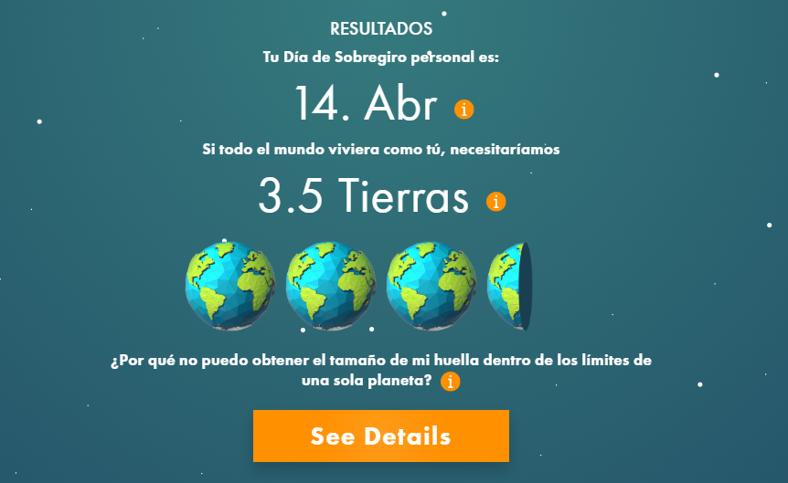
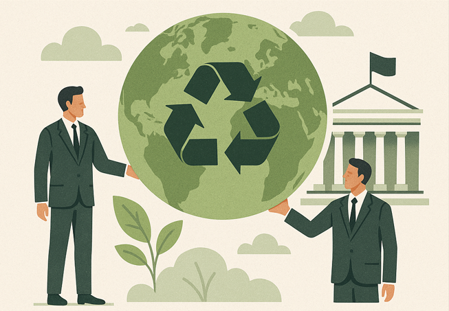

## DÍA 14 - 09-01-2025

### Resumen de la clase

En la clase de hoy hemos hablado sobre la contaminación y la gestión de residuos, comenzando por la reflexión de qué es realmente un residuo. Un residuo es algo que sobra, que ya no queremos y que tiramos a la basura, pero entonces, ¿qué pasa después con todo eso?

Hemos hablado de una de las principales fuentes de residuos, que son los residuos orgánicos. Como una solucion muy eficiente, hemos comentado el compostaje a nivel industrial, el cual tiene varias ventajas, como reutilizar residuos como fertilizante, reducir la cantidad de basura y generar energía. Sin embargo, no todos los residuos son tan fáciles de gestionar. Un ejemplo muy impactante ha sido el de las montañas de basura electrónica en Ghana, donde acaban muchos de los dispositivos que desechamos en los países desarrollados. Hubo un tiempo en que los residuos se mandaban completos, incluyendo metales valiosos que iban dentro, pero hoy en día, se mandan ya "limpios" de estos metales, dejando sólo el plástico residual. 

También hemos comentado problemas de contaminación muy visibles como las bolas de grasa y toallitas (o fatbergs) que se forman en las alcantarillas, o imágenes llamativas como ríos que arden o aparecen cubiertos de espuma. Otro punto importante ha sido el de los disruptores endocrinos, presentes en muchos plásticos, y el proceso de bioacumulación, donde al final nosotros acabamos siendo el filtro final de todas esas sustancias. Aunque conocía el tema de los disruptores endocrinos me ha parecido muy interesante el hecho de que algunos plásticos tengan la forma de las hormonas y por ello "hackean" nuestro sistema, punto que desconocía. 

Por último, hemos reflexionado sobre la ropa que ya no utilizamos y sobre el enorme valor de los residuos electrónicos, destacando que hay más oro en mil móviles usados que en una tonelada de mineral de oro, lo que hace cuestionarnos por qué seguimos extrayendo nuevos recursos en lugar de reutilizar los que ya están refinados en los vertederos.

### Ejemplos

- Montañas de residuos electrónicos acumulados en países como Ghana.  
- Bolas de grasa y toallitas bloqueando las alcantarillas.  
- Ríos que arden o aparecen cubiertos de espuma debido a la contaminación.  
- Sustancias químicas de los plásticos que alteran las hormonas y se acumulan en la cadena alimentaria.  
- Fast fashion y la cantidad de residuos que genera (muchas veces plástico en forma de poliéster) 

### Pregunta del día: ¿Por qué cambiaste tu último móvil?

En mi caso, cambié mi último móvil porque dejó de funcionar correctamente y se quedó sin espacio, ya que cada vez las aplicaciones ocupan más GB. Otro problema importante fue la duración de la batería, que era muy reducida, teniendo que cargar el dispositivo hasta 3 veces al día. Pensando en sostenibilidad, podría haber cambiado la batería, pero también tenía la pantalla rota y el coste de dejarlo en buen estado era muy similar al de comprar uno nuevo, contando también en añadirle una memoria extra (que además no se podía hacer de forma sencilla con una microSD por ejemplo).

Aquí se reflejan claramente dos problemas principales: la obsolescencia programada, tanto en almacenamiento como en batería, y la presión constante de la evolución tecnológica, que hace que los dispositivos se queden obsoletos muy rápido.

### Reflexión personal

La clase de hoy me ha hecho reflexionar sobre lo poco que valoramos lo que tiramos. Muchas veces tratamos los residuos como algo sin importancia, cuando en realidad contienen materiales muy valiosos que ya han sido extraídos y refinados, con un gran coste ambiental detrás. Además creo que debemos replantearnos un par de veces qué podríamos hacer con algo antes de tirarlo, ya que podemos contribuir a reducir nuestros residuos de esa manera. Por ejemplo, antes de tirar una camiseta, convertirla en trapos para limpiar. Y en el ambito tecnológico por ejemplo, pensar en reparar antes que en desechar. 

Me resulta especialmente contradictorio que sigamos explotando nuevas minas mientras acumulamos recursos en vertederos, simplemente porque resulta más cómodo seguir con el modelo actual. Creo que el problema no es solo tecnológico, sino también de mentalidad y de sistema. Hasta que no se priorice de verdad la reutilización y la reparación frente a la compra constante de productos nuevos, seguiremos generando residuos a un ritmo que no es sostenible.

## DÍA 13 - 12-12-2025

Hoy no he podido asistir a clase.

## DÍA 12 - 05-12-2025

### Resumen de la clase

Hoy hemos visto el tema de la huella ecológica y la huella de carbono. Es importante saber cómo funciona la Tierra si queremos usarla bien, igual que cuando te enseñan a ir en bici: si no sabes, te caes.  
Comentó también que a veces nos pasa por exceso de confianza, pensamos “una vez más no pasa nada” y al final sí pasa.  

Hemos comentado que hay expertos que crean sistemas de referencia para medir si lo estamos haciendo bien o mal, y que nosotros solo tenemos que entenderlos y ver nuestra “nota” (sistema de referencia comentado en clases anteriores). 
Todos usamos recursos de la Tierra y tiramos desechos, pero el problema es que gastamos más de lo que el planeta puede regenerar.  

La huella ecológica se mide en hectáreas globales por persona. Si una persona gasta en tres meses lo que la Tierra produce en un año, está generando un déficit.  
También hemos comentado los principales productores de CO₂, como las fábricas, la electricidad, los coches y hasta los seres vivos. Desde los años 50, con el boom industrial, hemos ido aumentando tanto que ahora necesitamos *1,7 planetas* para mantener el ritmo.  

Me ha llamado mucho la atención que Internet sería el sexto país más contaminante del mundo, y que como programadores también tenemos responsabilidad: si hacemos código más eficiente, el hardware dura más y contaminamos menos.  

### Ejemplos

- Si una persona gasta en 3 meses lo que el planeta produce en un año → déficit ecológico.  
- Los animales como los elefantes generan desechos orgánicos y sostenibles, pero los humanos producimos demasiado y somos demasiados.  
- La bici que va a 30 km/h y nosotros la llevamos a 32 → un pequeño cambio que puede tener un gran impacto.  

### Pregunta del día: ¿Cuál es tu huella de carbono?

Hemos hecho el test en [footprintcalculator.org](https://www.footprintcalculator.org) para calcular nuestra huella y ver cuántos planetas necesitaríamos si todos viviéramos igual que nosotros.  

### Reflexión personal

El test me hizo darme cuenta de cuánto impacto tengo sin darme cuenta. Al ver cuántos planetas necesitaríamos si todos viviéramos como yo, me sorprendí mucho.
Creo que medirlo es importante para saber por dónde empezar a mejorar. Igual que con la bici del ejemplo: si entiendes cómo funciona, no te caes.  

También surge la reflexión de que si yo, que considero que en algunos aspectos soy más eficiente que la media (viajo poco, no utilizo calefacción) aún así tengo un consumo de 3.5 tierras al año, imagino que esto se "compensa" para llegar al 1.7 al año global, con personas de países menos desarrollados. Esto presenta un problema global muy complicado de abordar.

## DÍA 11 - 28-11-2025

### Resumen de la clase

En la clase de hoy hemos estado hablando sobre la economía circular, centrándonos en cómo aplicar este concepto a la producción y consumo de bienes. La idea central es que todo lo que usamos debería intentar mantenerse en uso el mayor tiempo posible: reparando, reutilizando y reciclando antes de pensar en fabricar algo nuevo.

Hemos visto que muchas veces no valoramos lo que tiramos porque no siempre es evidente su valor. Por ejemplo, hay cosas cuya reutilización es obvia, como la chatarra, pero otras, como los gases, son más complicadas de valorar porque sus efectos no siempre nos afectan directamente a nosotros, sino a otros o al medio ambiente.

También hemos comentado la importancia de producir de manera más circular: usar materiales que sean fáciles de reutilizar para reducir el desperdicio y "circularizar" el ciclo de vida de un producto. A parte de esto es importante que sepamos que para todo esto, siempre vamos a necesitar energía para transformar materiales.

En conclusión, queda claro que las decisiónes más circulares siempre implican priorizar la reparación y la reuitilización sobre la fabricación nueva. 

### Ejemplos

Para debatir sobre la idea de la economía circular hemos usado dos ejemplos en los que vemos que la gestión de residuos es claramente beneficiosa y otro en el que no tanto.
La gestión de residuos es beneficiosa en el caso de la chatarra, ya que quién la recoge y procesa gana dinero de ella. Sin embargo, nadie recoge las cáscaras de plátano, ya que no es tan fácil obtener un dinero a cambio de ello.

### Pregunta del día: ¿Y a mi qué? ¿Enfoque colectivo o individual?

Podemos pensar que hay una parte individual, particularmente la de las decisiones que tomamos, comprar un coche u otro. Sin embargo, la mayor responsabilidad recae a nivel empresarial y gubernamental, mediante políticas y normativas que obliguen a enfocar los procesos hacia esta circularidad. 

### Reflexión personal

La clase de hoy me ha gustado, y particularmente la respuesta a la pregunta, ya que tiendo a sentir cierta responsabilidad o culpabilidad por no optar por las opciones más sostenibles o reutilizables. Sin embargo, en un contexto en el que el tiempo y el dinero nos limita constantemente, comprendo que mis elecciones no puedan basarse unicamente en la mejor opción a nivel de sostenibilidad, sino en aquella que me resulte más cómoda o más asequible. Y sobretodo, que la mayor responsabilidad no es mía, si no la de aquellos que deciden qué opciones ofrecernos a los consumidores.

## DÍA 10 - 21-11-2025

El profesor no ha venido a clase.

## DÍA 9 - 14-11-2025

### Resumen de la clase

En la clase de hoy hemos estado hablando sobre el análisis del ciclo de vida de un producto. De forma resumida es el análisis que se realiza para ver la cantidad y origen de los recursos que se utilizan para fabricar un producto, así como su posterior distribución, uso y gestión final. Hemos visto este análisis como una forma de representación, igual que lo es la nota para representar el trabajo que hacemos los estudiantes. 

Mediante el ejemplo del teléfono móvil, explicado debajo, hemos hablado del concepto de "coste oculto", que surge del gasto material y energético en los procesos de fabricación. Por ejemplo, primero se extrae el petróleo, después se transporta a fábricas donde puedan convertirlo en pellets de plástico, luego se lleva a fábricas de carcasas para teléfonos, y por último a fábricas de teléfonos para el ensamblaje final. Así que simplemente para la fabricación de la carcasa de un teléfono, se han pasado por múltiples procesos, suponiendo un coste energético y material relevante. 

También hemos valorado las fuentes de energía, como principales el sol y la nuclear, y como otras fuentes la luna (con las mareas), la hidroeléctrica y la geotérmica. 

Por último hemos visto los conceptos de economía lineal y circular. La primera, la que hemos estado siguiendo durante mucho tiempo, y la segunda, representa el futuro deseable y necesario.

### Ejemplos

El ejemplo alrededor del cual ha girado toda la clase ha sido el de un teléfono móvil. Es una herramienta que pesa unos 150g de media, pero para su fabricación se utilizan unos 80kg de recursos, entre Silicio, Cobre, Litio y Petroleo (como materias primas) y la energía necesaria para su transformación. 

Además hemos contemplado otros ejemplos de evaluar lo que cuesta conseguir algo vs su rendimiento con el caso de la minería espacial como forma de obtención de recursos. Para ello se necesita un cohete, que pesa miles de toneladas y quizás solo podríamos traer como máximo una tonelada de material. Dicho así vemos que compensa poco.

### Pregunta del día: Cuando se fabrica una camiseta de algodón, ¿cuál es el consumo (coste oculto) que hay detrás en el proceso de gestión final?

Hemos tomado de referencia una camiseta de algodón de 200g. Para todo su ciclo de vida se estima un coste oculto de aproximadamente 2000kg, principalmente debido al agua utilizada en el cultivo del algodón. La fase de gestión final representa solo unos 0,3 kg, considerando transporte, vertedero, incineración, reciclaje, impacto material ambiental y costes de oportunidad de recursos. Aunque esta fase representa una fracción pequeña del total, su impacto ambiental puede ser relevante si las camisetas se acumulan en vertederos o liberan microfibras. 

### Reflexión personal

Tras el debate de hoy de clase, me queda claro que la única solución para no quedarnos sin recursos es recurrir a la economía circular, ya que la economía lineal la veo como una pila (la tierra) de recursos de la que únicamente se extraen, pero no se "recargan". Recargarla o dejar de vaciarla es imprescindible para mantenernos vivos y "cómodos" durante más tiempo.

## DÍA 8 - 07-11-2025

No ha venido el profesor por lo que no hemos podido avanzar con las pequeñas explicaciones. He aprovechado el tiempo para trabajar en la web grupal.

## DÍA 7 - 31-10-2025

Para empezar hacemos un breve repaso de lo que hemos visto hasta ahora en la asginatura, que ha sido la comparativa de los humanos con los animales, en cuanto a reproducción, persistencia en el medio y comportamientos. 

Ahora vamos a ampliar un poco la perspectiva de los temas, pasando a la visión más política, enfocándonos en los problemas, etc. 

Comenzamos con la pregunta de si el universo es finito, realmente no se sabe. Lo que sí podemos saber es que la Tierra, sí es finita, tiene recursos que se acabarán. Con estos recursos limitados y el consumo exponencial, ¿cómo mantenemos el equilibrio? Volviendo a lecciones anteriores, si comparamos el moho y la rebanada de pan con los humanos y la Tierra, podemos ver que todavía no se nos ha acabado la tostada pero sabemos que se va a acabar. 

En nuestro tipo de crecimiento (k) se observar ciertas curvas, estas curvas llevadas a la realidad las podemos comparar con eventos que vemos en las noticias: las guerras, el covid, el hambre y la pobreza.

Al ritmo de consumo de recursos actual, necesitariámos 1'7 planetas para que esto fuera sostenible. En caso de que todos los seres de la tierra viviesen como se vive en los países desarrollados, necesitaríamos 5 planetas Tierra a nivel de recursos. 

También hemos comentado el ciclo cerrado de la biosfera, cómo el carbono se va transformando y vuelve a nosotros de otra forma - por ejemplo: nosotros generamos CO2, que es absorbido por las plantas, y luego hay animales y personas que comen plantas. 

Por último hemos estado investigando sobre el origen del agua, particularmente en un pueblo como Jumilla que no tiene ríos ni pantanos cerca. En nuestro caso el agua viene de los acuíferos, y podemos encontrar múltiples pozos que sirven para su extracción. En lugar de primar la conservación de los acuíferos, lo que se ha hecho ha sido explotarlos, aumentando el precio del agua conforme bajaba el nivel del acuífero. Esto tiene muchas consecuencias debido a las tres dimensiones inseparables de la sostenibilidad: la ambiental, la social y la económica. Si un agricultor paga 10 veces más por el agua de lo que pagaba en un principio, el melocotón costará 10 veces más para que su negocio sea sostenible, con las consecuencias sociales que eso acarrea - ¿quién puede permítirselo? ¿elegiremos comprar más barato aquellos productos que provengan de zonas con mejor acceso al agua? Si dejamos de comprar melocotones locales, ¿se hundirá la agricultura local?

## DÍA 6 - 24-10-2025

Comenzamos la clase viendo las dos estrategias de reproducción y adaptarnos al medio: las estrategias R y K. A pesar de la gran diversidad entre los seres vivos, todos podemos clasificarnos en esas dos estrategias. 
Las especies oportunistas (r) crecen muy rápido pero van fluctuando. Invierten menos tiempo en cuidar a los hijos y al reproducirse crean un número muy grande de individuos (miles). La estrategia es "a algunos les irá bien y a otros no".
Las especies en equilibrio (k) crecen no tan rápido y llegan al punto máximo y alcanzan un cierto equilibrio. Respecto a las crías, dedican mucho más tiempo a cuidar a los hijos y tienen muchas menos crías, entre 1 y 10 dependiendo de la especie. 

Hemos visto el ejemplo de los insectos y los elefantes, los primeros representando la especie r y los segundos la especie k. Son los genes que hay en cada uno lo que les lleva a reproducirse de esta manera, con el objetivo de permanecer. Todos los seres vivos morimos, lo cual es positivo ya que al reproducirnos sucede la evolución, lo que nos permite adaptarnos al medio. 

### Pregunta del día: ¿Qué estrategia usamos los humanos?

La k, ya que invertimos mucho tiempo en el cuidado parental y tenemos un número bajo de hijos. Podemos encontrar algunas diferencias entre países pero a nivel general y en comparación con otras especies, seguimos la estrategia k. 

Teniendo esto en cuenta, sabemos que los individuos que siguen la estrategia k, como nosotros, somos más sensibles a los cambios y nos cuesta mucho más gestionarlos y adaptarnos a ellos, por lo tanto, nos interesa la estabilidad, que el ambiente cambie lo menos posible, y por eso es importante el concepto de sostenibilidad.

## DÍA 5 - 17-10-2025

Comenzamos la clase con la pregunta: ¿Vivimos solos? La respuesta es que no, vivimos en comunidad con otros humanos y otras especies, y por tanto, lo que hacen los demás nos influye, en muchas ocasiones nos obliga a modificar nuestro comportamiento, como cuando te cruzas con alguien por una acera estrecha o como cuando estás debajo de un árbol donde hay palomas soltando excrementos. 
Las relaciones entre especies se llevan estudiando años, y se pueden clasificar en intraespecíficas (entre la misma especie) o interespecíficas (entre distintas especies). En las interespecíficas podemos distinguir varios tipos dependiendo de si es beneficiosa, indiferente o negativa para una o ambas partes de la relación.
Estas relaciones son muy importantes porque pueden hacernos la vida más fácil o más difícil, por ejemplo, la flora bacteriana de nuestro estómago nos ayuda a hacer la digestión, pero si tenemos piojos estamos muy incómodos y pueden transmitirnos enfermedades. 
Los humanos también tenemos estas relaciones entre nosotros, por ejemplo, el grupo de vecinos de Sarrión (Teruel) que descrubrieron lo que pasaba con las trufas y decidieron crear una cooperativa y una DOP para explotar ese "tesoro". Sin embargo, como analizamos en la pregunta del día, no siempre encontramos cooperación con los demás.

### Pregunta del día: ¿Qué hacemos nosotros: cooperamos o competimos?
En general la población no coopera. Solo se copera con el que tienes al lado (familia, amigos, vecinos) pero el resto de la población nos suele resultar "indiferente" y tendemos a competir con ellos. A nivel global hay una gran competición por ver quién gana más dinero, según dicen, "lo que mueve el mundo".
En el ejemplo en el que Pablo va a buscar las trufas de un señor que cultiva encinas para conseguirlas, Pablo coopera con su amigo para conseguir la escopeta con la que enfrentarse a él, pero el trufero y él compiten por el mismo objetivo: conseguir la trufa y sacar dinero.

## DÍA 4 - 10-10-2025

En la clase de hoy hemos reflexionado alrededor del concepto de capacidad de carga, que es lo que un sistema puede soportar. Hemos estado trabajando alrededor de un ejemplo con el comportamiento del moho, que particularmente me ha servido de mucha utilidad.
El moho no se "sale" del pan, se queda en el máximo de la capacidad de carga de su sistema, que es el pan. Cuando se acabe lo que al moho le gusta del pan, el moho estará menos cómodo y empieza a hacer cambios: deja de reproducirse, se van muriendo, etc.

La definición como tal de sistema de carga es el límite máximo de individuos que puede soportar un sistema sin degradarse (en el caso del moho, que no haya pan). 
Hemos visto un vídeo en el que unos microorganismos se multiplican exponencialmente, para reflexionar sobre que eso es así hasta que se acaban los recursos y empieza la "incomodidad". 
Naturalmente se observa cómo los microorganismos hacen lo máximo posible para evitar la degradación (para sobrevivir en buenas condiciones el mayor tiempo posible), por lo que vemos como el moho no se pone a tirar migas de pan fuera, si no que intenta conservarlas.

Esos momentos de incomodidad por la falta o escasez de recursos se representan como pequeñas curvas (pequeñas subidas y bajadas) en una curva de crecimiento. Suponen la incomodidad de la población porque se están llegando a los límites (guerras, disputas).

Los recursos que hacen que esto suceda porque nos limitan son: agua, alimento y espacio. Ejemplos de límites superados son la deforestación extrema por ejemplo. Si queremos seguir teniendo lo que obtenemos de los árboles, deberíamos "cambiar" un árbol por otro.

### Pregunta del día: ¿Hay un límite para la población humana?
Definitivamente sí. Aunque no sepamos muy bien cuál es, está claro que está relacionado con los recursos y su agotamiento. Creo que deberíamos aprender más del moho y no desperdiciar migas de pan fuera de lo que necesitamos para cubrir nuestras necesidades básicas. 

## DÍA 3 - 03-10-2025

Hoy hemos dedicado la clase a comparar a los humanos con los animales. Nos ha quedado claro que tenemos muchas similitudes (dependencia vital, limites biológicos, y parte del ecosistema, además estamos "construidos" con las mismas piezas).
Sin embargo, también encontramos algunas diferencias, y es que poseemos un lenguaje completo (que nos permite, por ejemplo, enseñar sin necesidad de "imitar", sino, "explicando"), tecnología avanzada y la posibilidad de transmitir la cultura.
Además encontramos algunos problemas, como el impacto sin precedentes que estamos generando, la modificación del entorno y la escala global. Si comparamos, los animales también modifican su entorno pero en su escala: una hormiga modifica el suelo, un castor los ríos, y los humanos el mundo.

### Pregunta del día - ¿Acabaremos con la vida en nuestro planeta?
La vida incluye muchos tipos de seres vivos, como sabemos, los grandes grupos: humanos, animales/insectos y plantas. Parece fácil pensar que con el deterioro de la Tierra y sus recursos, los humanos serán los primeros en extinguirse. Sin embargo, creo que será más complicado para otras formas de vida como los virus, las bacterias y otros microorganismos o incluso seres acuáticos cuyas condiciones de vida no son tan "sensibles" o "exigentes" como las nuestras. 

# OCTUBRE

## DÍA 2 - 26-09-2025

Hemos trabajado sobre el concepto de sostenibilidad como una mezcla de no dejar que algo caiga/sujetarlo y una necesidad/problema. En este concepto la variable tiempo es muy significativa. 
Es de interés común sostener la civilización, para que al menos podamos mantener los privilegios actuales que tenemos, para ello hay que mantener un equilibrio entre los aspectos sociales, ambientales y económicos. 
Hay que diferenciar entre ecología y ecologismo, el primero es una ciencia y el segundo es política. 

Mi reflexión personal al respecto es que ahondar en el origen de la palabra me parece importante para llegar a la raíz del problema e incluso aclaratorio. Además, comparto totalmente el pretexto de que la sostenibilidad es un interés
común para mantener lo que ya tenemos.

## DÍA 1 - 19-09-2025

### Introducción al módulo

En esta clase el profesor nos ha explicado la asignatura. Cuáles son los RA de aprendizaje que tenemos que superar, de qué manera vamos a trabajar y qué se nos va a evaluar.

#### Parte 1
En primer lugar, cada una de las 18 sesiones comenzará con una explicación por parte del profesor de **5-10 minutos**. Tras esa explicación haremos un pequeño debate profesor-alumnos en el que podremos exponer nuestros puntos de vista, explicar qué pensamos sobre las políticas implementadas y reflexionar sobre nuestras propias ideas y las expuestas por los compañeros.

Después, haremos un **diario** en el que incluiremos un breve resumen sobre la explicación y también podremos comentar algo sobre nuestra opinión o sobre el debate. 

#### Parte 2
El resto de la clase, unos **40-45 minutos**, trabajaremos en grupo. Los grupos están formados según las 5 filas que hay en la clase y se mantendrán todo el curso. El objetivo de este trabajo en equipo será producir como resultado una página web, compuesta por las siguientes 3 secciones:

##### Sección 1
Para esta sección tendremos que elegir una civilización o sistema, de la cual tendremos que describir su funcionamiento con relación a la sostenibilidad.  
Mencionaremos 3 puntos:  
1. Obtención de recursos  
2. Obtención de la energía  
3. Posibilidades de supervivencia  

##### Sección 2
En esta sección trabajaremos con respecto a los **ODS**. Debemos describir, analizar, pensar y reflexionar sobre esas políticas. De ese análisis veremos que cuando la cosa se complica, tenemos que tomar medidas.  
Veremos si nuestra civilización o sistema elegidos tomaron o no medidas, qué pasó, qué problemas llevaron a la insostenibilidad, etc.

##### Sección 3
Se aplican las otras secciones al **sector productivo (Informática en nuestro caso)**. Se trata de ver qué podemos hacer desde nuestro sector para resolver los problemas.  

Tendremos que seleccionar **dos productos** que se estén vendiendo como una mejora, un producto verde, o que se esté vendiendo como sostenible:  
- Una de las opciones debe ser de nuestro sector.  
- La otra puede ser de otro sector.  

Podemos seleccionarlos tanto para decir sobre ellos que nos parecen una buena solución o que no, y los argumentos correspondientes.  

En esta sección también veremos el **plan de sostenibilidad**, que deben hacer empresas de cierto tamaño.

# SostenibilidadDeAlba

Repositorio para la asignatura Sostenibilidad Aplicada al Sector Productivo. 
